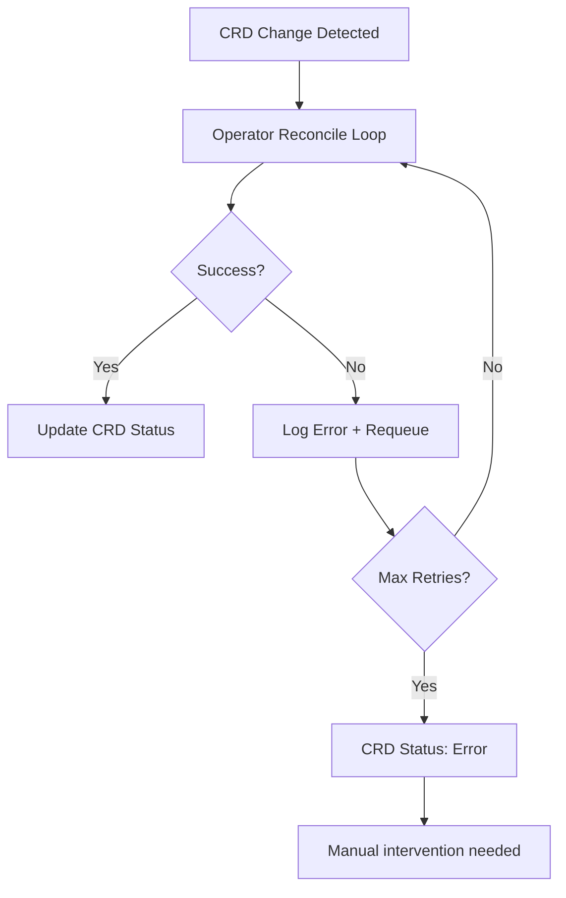

# How to Handle Rook-Ceph Operator Failures

Author: [nawazdhandala](https://www.github.com/nawazdhandala)

Tags: Rook, Ceph, Kubernetes, Operator, Troubleshooting, Storage

Description: Diagnose and recover from Rook-Ceph operator failures, including crash loops, reconciliation errors, and stuck resource states using logs and kubectl commands.

---

## How the Rook Operator Works

The Rook operator is a Kubernetes controller that watches CephCluster, CephBlockPool, CephObjectStore, and other Rook CRDs. It reconciles the desired state with the actual cluster state. When the operator crashes or gets stuck, Rook stops managing Ceph daemons - existing workloads continue to function, but changes (new PVCs, upgrades, scaling) are blocked.



## Step 1 - Check Operator Pod Status

Check if the operator pod is running:

```bash
kubectl -n rook-ceph get pods -l app=rook-ceph-operator
```

If the pod is in `CrashLoopBackOff` or `Error`, check the logs:

```bash
kubectl -n rook-ceph logs deployment/rook-ceph-operator --previous
```

Check the last 100 lines for the crash cause:

```bash
kubectl -n rook-ceph logs deployment/rook-ceph-operator --tail=100
```

## Step 2 - Diagnose Common Operator Failures

Check for permission errors (usually RBAC misconfiguration):

```bash
kubectl -n rook-ceph logs deployment/rook-ceph-operator --tail=200 | grep -i "forbidden\|unauthorized\|permission"
```

If you see `forbidden: User "system:serviceaccount:rook-ceph:rook-ceph-system" cannot ...`, re-apply the RBAC resources:

```bash
kubectl apply -f https://raw.githubusercontent.com/rook/rook/release-1.16/deploy/examples/common.yaml
```

Check for CRD schema validation errors:

```bash
kubectl -n rook-ceph logs deployment/rook-ceph-operator | grep -i "invalid\|validation\|schema"
```

These occur when CRDs are not updated after a Rook upgrade. Re-apply the CRDs:

```bash
kubectl apply --server-side -f \
  https://raw.githubusercontent.com/rook/rook/release-1.16/deploy/examples/crds.yaml
```

## Step 3 - Check Resource Reconciliation Status

Check the CephCluster status for errors:

```bash
kubectl -n rook-ceph get cephcluster rook-ceph -o jsonpath='{.status}' | python3 -m json.tool
```

The `conditions` field shows the current state. Look for `Failure` or `Error` types.

Check all Rook CRDs for error conditions:

```bash
kubectl -n rook-ceph get cephblockpool
kubectl -n rook-ceph get cephfilesystem
kubectl -n rook-ceph get cephobjectstore
```

Get detailed status of a failing resource:

```bash
kubectl -n rook-ceph describe cephblockpool replicapool
```

## Step 4 - Force Reconciliation

If the operator is running but a resource is stuck, force reconciliation by toggling the do-not-reconcile label:

```bash
kubectl -n rook-ceph label cephcluster rook-ceph \
  ceph.rook.io/do-not-reconcile=true --overwrite
kubectl -n rook-ceph label cephcluster rook-ceph \
  ceph.rook.io/do-not-reconcile-
```

Alternatively, restart the operator pod to reset the reconciliation queue:

```bash
kubectl -n rook-ceph rollout restart deployment/rook-ceph-operator
```

Watch the operator restart:

```bash
kubectl -n rook-ceph rollout status deployment/rook-ceph-operator
```

## Step 5 - Handle Stuck Finalizers

If a Rook resource is stuck in `Terminating` state, it may have a finalizer that the operator failed to remove. Check for finalizers:

```bash
kubectl -n rook-ceph get cephcluster rook-ceph -o jsonpath='{.metadata.finalizers}'
```

If the operator is not running and the resource must be removed, manually remove the finalizer:

```bash
kubectl -n rook-ceph patch cephcluster rook-ceph \
  -p '{"metadata":{"finalizers":[]}}' \
  --type=merge
```

Use this only when you intentionally want to remove the resource and the operator cannot do it automatically.

## Step 6 - Diagnose Operator Pod Scheduling Issues

The Rook operator deployment uses `replicas: 1` with `strategy: Recreate`, so only one operator pod runs at a time. If the old pod is stuck terminating (for example due to node failures or stuck volume unmounts), the replacement pod cannot be scheduled.

Check if a pod is stuck in `Terminating`:

```bash
kubectl -n rook-ceph get pods -l app=rook-ceph-operator
```

If a pod is stuck terminating, force-delete it:

```bash
kubectl -n rook-ceph delete pod -l app=rook-ceph-operator --force --grace-period=0
```

Then verify the new pod starts:

```bash
kubectl -n rook-ceph rollout status deployment/rook-ceph-operator
```

## Step 7 - Operator ConfigMap Issues

The `rook-ceph-operator-config` ConfigMap controls key operator settings. An invalid value can prevent the operator from starting:

```bash
kubectl -n rook-ceph get configmap rook-ceph-operator-config -o yaml
```

Common invalid settings that cause failures:

- Invalid log levels in `ROOK_LOG_LEVEL`
- Wrong boolean string (use `"true"` not `true`)
- CSI image overrides pointing to non-existent images

Reset to defaults by deleting the ConfigMap:

```bash
kubectl -n rook-ceph delete configmap rook-ceph-operator-config
```

The operator will fall back to built-in defaults and environment variables when the ConfigMap is absent. You do not need to recreate it for the operator to start.

## Step 8 - Enable Operator Debug Logging

For deeper investigation, increase operator log verbosity:

```bash
kubectl -n rook-ceph set env deployment/rook-ceph-operator \
  ROOK_LOG_LEVEL=DEBUG
```

Then tail the logs:

```bash
kubectl -n rook-ceph logs -f deployment/rook-ceph-operator
```

Reset log level after debugging:

```bash
kubectl -n rook-ceph set env deployment/rook-ceph-operator \
  ROOK_LOG_LEVEL=INFO
```

## Summary

Rook-Ceph operator failures typically fall into three categories: CrashLoopBackOff (check previous logs for the root cause), reconciliation errors on CRDs (check CRD status conditions), and stuck finalizers (manually remove if operator is unavailable). Common causes include RBAC misconfiguration, stale CRDs after upgrades, invalid ConfigMap values, and stuck terminating pods blocking replacement. Restarting the operator pod resolves most transient issues, while RBAC and CRD mismatches require re-applying the correct manifests.
