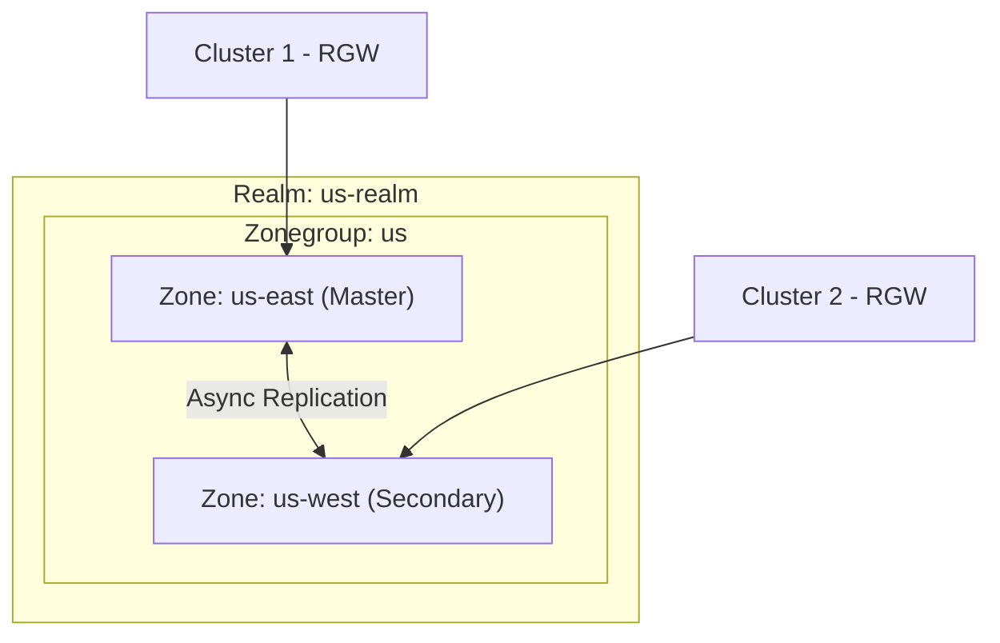

# How to Configure Rook-Ceph for Multi-Site Object Replication

Author: [nawazdhandala](https://www.github.com/nawazdhandala)

Tags: Rook, Ceph, Kubernetes, Object Storage, Multi-Site, Replication, RGW

Description: Configure Rook-Ceph multi-site object replication to synchronize S3-compatible object stores across multiple Kubernetes clusters for geo-redundancy.

---

## How Ceph Multi-Site Object Replication Works

Ceph RadosGW (RGW) supports multi-site replication through a hierarchy of realms, zonegroups, and zones. Each zone holds an independent object store, and Ceph synchronizes objects between zones within a zonegroup automatically. This enables active-active or active-passive geo-replication.



## Prerequisites

- Two Rook-Ceph clusters, each with an object store deployed
- Network connectivity between the two clusters (RGW endpoints reachable)
- `rook-ceph-tools` available on both clusters
- The Rook operator version 1.9 or later (CRD-based multi-site support)

## Step 1 - Create the Realm on the Master Cluster

On the master cluster, create a CephObjectRealm:

```yaml
apiVersion: ceph.rook.io/v1
kind: CephObjectRealm
metadata:
  name: us-realm
  namespace: rook-ceph
```

Apply it:

```bash
kubectl apply -f realm.yaml
```

## Step 2 - Create the Master Zonegroup

```yaml
apiVersion: ceph.rook.io/v1
kind: CephObjectZoneGroup
metadata:
  name: us
  namespace: rook-ceph
spec:
  realm: us-realm
```

```bash
kubectl apply -f zonegroup.yaml
```

## Step 3 - Create the Master Zone

```yaml
apiVersion: ceph.rook.io/v1
kind: CephObjectZone
metadata:
  name: us-east
  namespace: rook-ceph
spec:
  zoneGroup: us
  metadataPool:
    replicated:
      size: 3
  dataPool:
    replicated:
      size: 3
```

```bash
kubectl apply -f zone-master.yaml
```

## Step 4 - Deploy the Object Store on the Master Zone

```yaml
apiVersion: ceph.rook.io/v1
kind: CephObjectStore
metadata:
  name: us-east-store
  namespace: rook-ceph
spec:
  gateway:
    port: 80
    instances: 2
  zone:
    name: us-east
```

```bash
kubectl apply -f objectstore-master.yaml
```

## Step 5 - Export Realm Credentials

On the master cluster, create a system user for realm sync operations and retrieve its credentials:

```bash
kubectl -n rook-ceph exec -it deploy/rook-ceph-tools -- \
  radosgw-admin user create \
    --uid=realm-sync \
    --display-name="Realm Sync User" \
    --system

# Retrieve the access-key and secret-key from the output
kubectl -n rook-ceph exec -it deploy/rook-ceph-tools -- \
  radosgw-admin user info --uid=realm-sync
```

Store the credentials as a Secret on the secondary cluster:

```bash
kubectl create secret generic realm-us-realm \
  --from-literal=access-key="<access-key-from-system-user>" \
  --from-literal=secret-key="<secret-key-from-system-user>" \
  -n rook-ceph
```

## Step 6 - Join the Secondary Cluster to the Realm

On the secondary cluster, create the CephObjectRealm referencing the master:

```yaml
apiVersion: ceph.rook.io/v1
kind: CephObjectRealm
metadata:
  name: us-realm
  namespace: rook-ceph
spec:
  pull:
    endpoint: http://<master-rgw-endpoint>:80
    secretNames:
      - realm-us-realm
```

Create the secondary zone:

```yaml
apiVersion: ceph.rook.io/v1
kind: CephObjectZone
metadata:
  name: us-west
  namespace: rook-ceph
spec:
  zoneGroup: us
  metadataPool:
    replicated:
      size: 3
  dataPool:
    replicated:
      size: 3
```

Deploy the object store on the secondary zone:

```yaml
apiVersion: ceph.rook.io/v1
kind: CephObjectStore
metadata:
  name: us-west-store
  namespace: rook-ceph
spec:
  gateway:
    port: 80
    instances: 2
  zone:
    name: us-west
```

## Step 7 - Verify Replication is Active

On the master cluster, check zone sync status:

```bash
kubectl -n rook-ceph exec -it deploy/rook-ceph-tools -- \
  radosgw-admin sync status
```

Expect to see `sync is in progress` and replication lag information.

Check the realm configuration:

```bash
kubectl -n rook-ceph exec -it deploy/rook-ceph-tools -- \
  radosgw-admin realm list
```

Check zone info on both clusters:

```bash
kubectl -n rook-ceph exec -it deploy/rook-ceph-tools -- \
  radosgw-admin zone get --rgw-zone=us-east
```

## Configuring Sync Policy (Optional)

Ceph supports fine-grained sync policies to control which buckets are replicated. Configure sync policies using `radosgw-admin` on the master cluster:

```bash
# Create a sync group for selective replication
kubectl -n rook-ceph exec -it deploy/rook-ceph-tools -- \
  radosgw-admin sync group create \
    --group-id=selective-sync \
    --status=enabled

# Add a specific bucket to the sync group
kubectl -n rook-ceph exec -it deploy/rook-ceph-tools -- \
  radosgw-admin sync group flow create \
    --group-id=selective-sync \
    --flow-id=us-flow \
    --flow-type=symmetrical \
    --zones=us-east,us-west

kubectl -n rook-ceph exec -it deploy/rook-ceph-tools -- \
  radosgw-admin sync group pipe create \
    --group-id=selective-sync \
    --pipe-id=us-pipe \
    --source-zones=us-east \
    --dest-zones=us-west \
    --bucket=my-replicated-bucket
```

## Summary

Rook-Ceph multi-site object replication requires creating a realm, zonegroup, and zones using Rook CRDs. The master zone exports a realm token, which the secondary cluster uses to join the same realm. Once zones are linked, Ceph's RGW sync mechanism replicates objects between zones asynchronously. This configuration provides geo-redundant S3-compatible storage across multiple clusters. Note that failover requires manual intervention or external tooling such as DNS-based routing to redirect clients to the secondary zone.
