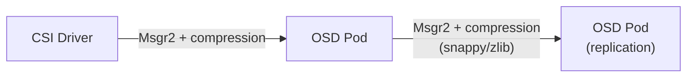

# How to Enable Network Compression in Rook-Ceph

Author: [nawazdhandala](https://www.github.com/nawazdhandala)

Tags: Rook, Ceph, Kubernetes, Network, Storage, Performance

Description: Enable Msgr2 network compression in Rook-Ceph to reduce network bandwidth usage for OSD replication and client traffic on bandwidth-constrained storage networks.

---

## Network Compression in Ceph

Ceph supports optional message-level compression via the Msgr2 protocol. When enabled, Ceph compresses data in flight between daemons and between clients and daemons. This reduces bandwidth usage at the cost of additional CPU cycles.

Compression is most beneficial when:
- Storage network bandwidth is the bottleneck
- Data being transferred is compressible (databases, logs, text)
- CPU headroom is available on storage nodes



## Enabling Compression

Configure compression in the `network.connections` section:

```yaml
apiVersion: ceph.rook.io/v1
kind: CephCluster
metadata:
  name: rook-ceph
  namespace: rook-ceph
spec:
  cephVersion:
    image: quay.io/ceph/ceph:v19.2.0
  dataDirHostPath: /var/lib/rook
  network:
    provider: host
    connections:
      encryption:
        enabled: false
      compression:
        enabled: true
      requireMsgr2: true
```

Note that compression requires Msgr2 (`requireMsgr2: true`). Compression does not work over the legacy Msgr1 protocol.

## Combining Encryption and Compression

Both can be set simultaneously:

```yaml
spec:
  network:
    connections:
      encryption:
        enabled: true
      compression:
        enabled: true
      requireMsgr2: true
```

However, when encryption is enabled, Ceph disables compression by default for security reasons. To force compression even when encryption is active, an admin must explicitly set `ms_compress_secure` to `true` via `ceph config set`. Without that override, compression is silently ignored on encrypted connections.

## Verifying Compression is Active

Check the Ceph configuration from the toolbox:

```bash
kubectl -n rook-ceph exec -it deploy/rook-ceph-tools -- \
  ceph config dump | grep -E "ms_osd_compress|ms_compress"
```

Expected output when compression is enabled:

```text
global   basic   ms_osd_compress_mode   force
```

Check the compression mode for a specific OSD:

```bash
kubectl -n rook-ceph exec -it deploy/rook-ceph-tools -- \
  ceph config get osd.0 ms_osd_compress_mode
# Expected: force
```

## Compression Algorithm

Ceph uses `snappy` as the default compression algorithm for messenger compression due to its speed. It provides moderate compression ratios with very low CPU overhead.

Check active compression algorithm:

```bash
kubectl -n rook-ceph exec -it deploy/rook-ceph-tools -- \
  ceph config get osd.0 ms_osd_compression_algorithm
# Expected: snappy
```

To configure a different algorithm (not recommended unless benchmarked):

```bash
kubectl -n rook-ceph exec -it deploy/rook-ceph-tools -- \
  ceph config set global ms_osd_compression_algorithm zlib
```

## Measuring Compression Effectiveness

Msgr2 wire compression does not expose dedicated per-connection compression ratio counters. The most practical way to measure effectiveness is to compare network throughput before and after enabling compression:

```bash
# Network stats on a storage node
sar -n DEV 5 3
```

You can also monitor OSD network bytes via the AsyncMessenger perf counters:

```bash
kubectl -n rook-ceph exec -it deploy/rook-ceph-tools -- \
  ceph tell osd.0 perf dump AsyncMessenger
```

Look at `msgr_send_bytes` and `msgr_recv_bytes` to observe changes in wire traffic volume after enabling compression.

## When NOT to Enable Compression

Avoid network compression when:

- Storing pre-compressed data (JPEG images, video files, zip archives) - compression ratio will be near 1.0 with CPU overhead wasted
- CPU is already saturated on storage nodes - compression adds meaningful CPU load on high-throughput clusters
- Network is not the bottleneck - if disk I/O is the bottleneck, compression provides no benefit

## Disabling Compression

```yaml
spec:
  network:
    connections:
      compression:
        enabled: false
```

Apply the updated CephCluster resource. Rook will trigger a rolling restart of Ceph daemons to apply the change, since compression is negotiated during the Msgr2 connection handshake.

## Summary

Network compression in Rook-Ceph is enabled via `network.connections.compression.enabled: true` and requires Msgr2 (`requireMsgr2: true`). It compresses Ceph wire traffic using the snappy algorithm, reducing bandwidth usage for OSD replication and client I/O at the cost of CPU cycles. Note that compression is disabled by default when encryption is also enabled. It is most beneficial when the storage network is bandwidth-constrained and data is compressible. Verify compression is active with `ceph config dump | grep ms_osd_compress` and monitor network throughput to confirm bandwidth savings.
